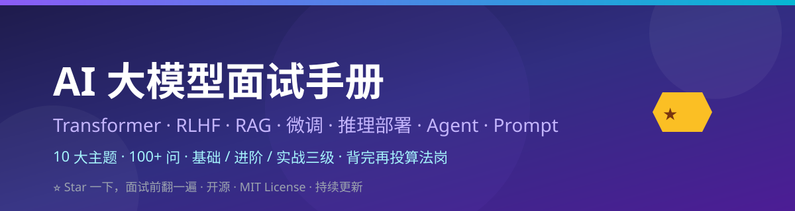

# 大模型面试 100 问——背完再投算法岗 🎯

> **面试大模型算法岗，到底会问什么？** Transformer 原理、RLHF 流程、RAG 怎么搭、LoRA 怎么调、vLLM 为什么快——这些八股文，平时看着会，一面试就忘。
>
> 这份手册把大模型面试**最高频的 100+ 问**整理成册，每题都有**答案要点（3-6 条，可直接背）+ 追问点（面试官顺着会问什么）**。分三级标注：【基础】【进阶】【实战】——从校招到社招全覆盖。

`llm-interview-zh` 是一份**纯 Markdown 的中文大模型面试题库**：打开就能背、按主题分文件、答案精简准确。

## 为什么值得收藏

- 📚 **10 大主题全覆盖**：Transformer / RLHF / RAG / 微调 / 推理部署 / Agent / Prompt / Tokenization / 多模态 / 场景手撕——大模型面试能考的，这里都有。
- 🎯 **每题都能直接背**：答案要点控制在 3-6 条，一句话一个得分点，不啰嗦。
- 🔍 **追问点设计**：每个问题后面附 1-3 个面试官可能的追问，提前准备好，面试不慌。
- 📊 **三级难度分级**：【基础】校招必考、【进阶】社招核心、【实战】拉开差距。
- ✍️ **全原创中文措辞**：不搬运任何教程原文，技术准确性优先。

## 速查索引（想刷哪块 → 打开哪篇）

| 主题 | 题数 | 适合谁 |
| --- | --- | --- |
| [01 Transformer 架构与注意力](topics/01-transformer.md) | 11 问 | 所有人，必考核心 |
| [02 RLHF 与对齐](topics/02-rlhf-alignment.md) | 10 问 | 做对齐/微调方向 |
| [03 RAG 检索增强](topics/03-rag.md) | 10 问 | 做应用落地的 |
| [04 微调（LoRA/QLoRA）](topics/04-finetuning.md) | 11 问 | 做模型训练的 |
| [05 量化与推理部署](topics/05-quantization-inference.md) | 10 问 | 做工程部署的 |
| [06 Agent 与工具调用](topics/06-agent-tool-calling.md) | 10 问 | 做 Agent/应用的 |
| [07 Prompt 工程](topics/07-prompt-engineering.md) | 10 问 | 所有人，日常用 |
| [08 Tokenization](topics/08-tokenization.md) | 10 问 | 偏底层/研究方向 |
| [09 多模态基础](topics/09-multimodal.md) | 10 问 | 做多模态方向 |
| [10 场景与手撕题](topics/10-scenarios-coding.md) | 10 问 | 面试压轴/手撕 |

## 难度分级说明

- 【基础】：概念题，必须脱口而出。考不到就是送分题，答不上基本凉。
- 【进阶】：原理题，需要讲清楚"为什么"。区分背过和真懂的。
- 【实战】：场景/设计/手撕题，考察工程经验和动手能力。拉开差距的题。

## 使用建议

1. **面试前 1 周**：先过一遍所有【基础】题，确保每道都能说出来。
2. **面试前 3 天**：重点刷【进阶】和目标岗位方向的【实战】题。
3. **面试前 1 天**：把目标公司面经里提到的主题，对照这份手册再过一遍。
4. **平时积累**：Star 收藏，遇到新的面试题欢迎提 Issue 补充。

## 题目格式示例

```markdown
### Q4 【进阶】KV Cache 的原理是什么？为什么能加速自回归推理？

- **答案要点**：
  1. 原理：前面 token 的 K、V 向量已经算过了，缓存起来，新 token 只算自己的 Q。
  2. 加速效果：Decode 阶段每步从 O(n²) 降到 O(n)。
  3. 显存代价：KV Cache 是长上下文推理的主要显存开销。
- **追问点**：
  - KV Cache 显存怎么优化？（GQA / INT8 KV 量化 / PagedAttention）
```

每道题都长这样：**题目 → 答案要点（可直接背）→ 追问点（提前准备）**。

## 手册结构

```
llm-interview-zh/
├── topics/                    # 10 个主题题库
│   ├── 01-transformer.md
│   ├── 02-rlhf-alignment.md
│   ├── 03-rag.md
│   ├── 04-finetuning.md
│   ├── 05-quantization-inference.md
│   ├── 06-agent-tool-calling.md
│   ├── 07-prompt-engineering.md
│   ├── 08-tokenization.md
│   ├── 09-multimodal.md
│   └── 10-scenarios-coding.md
├── assets/
│   └── banner.svg              # 原创横幅
├── SOURCES.md                  # 外部参考来源与许可
├── LICENSE                     # MIT License
└── README.md
```

## 质量承诺

- ✅ 每题答案经过技术准确性自查，公式/参数/流程确保正确
- ✅ 无占位符、无"待补充"——打开就能背
- ✅ 全原创中文措辞，只参考外部资料的覆盖面与思路
- ❓ 发现错误？开 [Issue](https://github.com/zieang88888/llm-interview-zh/issues)，核实后第一时间修正

## 星标理由（认真脸）

面试这种东西——**准备的时候觉得"我都会"，坐在面试官对面脑子一片空白**。
Star 一下，面试前翻两遍，比临时抱佛脚强十倍。⭐

## License

[MIT](LICENSE) © zieang88888

---

*整理不易，希望每一个拿到大模型 offer 的同学，都曾翻到过这份手册。*
